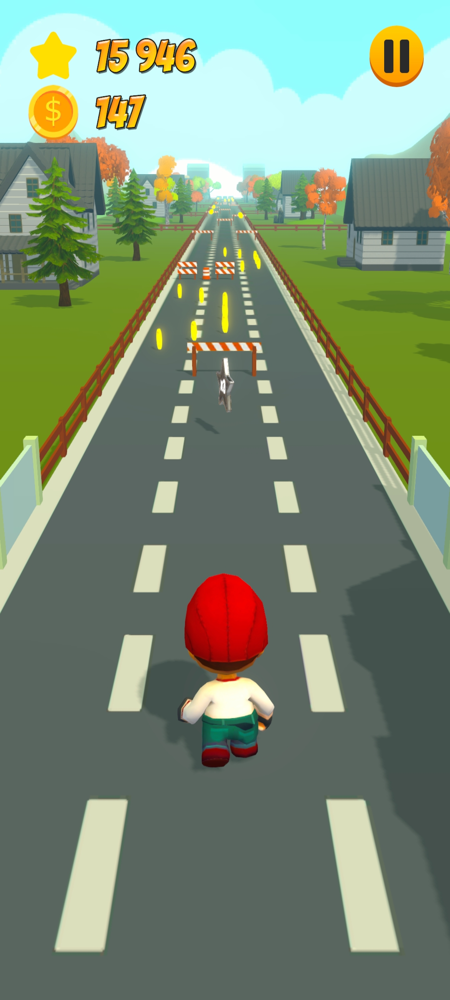

<h1 align="center">Runner</h1>
<h2 align="center">

</h2>

# Содержание
* [Описание](#описание)
    * [Начало игры](#начало-игры)
    * [Как играть](#как-играть)
    * [Еженедельный турнир](#еженедельный-турнир)
    * [Игровые настройки](#игровые-настройки)
    * [Геймплей](#геймплей)
      * [Игровая валюта](#игровая-валюта)
      * [Бонусы](#бонусы)
      * [Препятствия](#препятствия)
      * [Пауза](#пауза)
    * [Генерация игрового уровня](#генерация-игрового-уровня)
* [Использованные ассеты](#использованные-ассеты)

# Описание
Игра реализована на базе движка Unity (v.2021.3.6f1). 
Суть - вы бежите бесконечно вперёд, собирая монеты и 
бонусы на своём пути, обходя препятствия и набирая очки.

## Начало игры

В самом начале игры вам предлагается ввести свой никнейм.

<b> Правило: </b> Длина никнейма не должна быть меньше 3
символов. Если вы введёте короткий либо пустой никнейм,
игра предупредит Вас об этом

Как только вы ввели свой ник, кнопка старта игры станет 
доступной

## Как играть

В игре есть краткий гайд по управлению игровым персонажем
(кнопка со знаком вопроса в правом верхнем углу)

## Еженедельный турнир

Каждую неделю в игре проводится турнир. В турнире участвует
25 человек (включая вас). Игроки ранжируются по набранным 
очкам за всю неделю

В конце турнира разыгрыватся призы в зависимости от занятого
места

## Игровые настройки

В окне настроек вы можете включать\выключать музыку и звуки,
а также настроить качество графики

## Геймплей

### Игровая валюта

Пробегая, вы можете собирать монеты на уровне

Затем за собранные монеты вы покупаете здоровье. 1 единица
здоровья стоит 100 монет

### Бонусы

На уровне вы можете собирать бонусы для увеличения скорости
набора очков

 

При сборе множителя он будет отображаться в левом верхнем
углу. Время действия бонуса 10 сек.

Всего в игре существует 3 разных вида бонусов:
* С умножением на 2, выпадает с вероятностью 89%
* С умножением на 3, выпадает с вероятностью 10%
* С умножением на 5, выпадает с вероятностью 1%

### Препятствия

При столкновении с препятствием, вы умираете. Чтобы
продолжить игру, вам необходимо потратить вначале 1
здоровье. Каждое следующее восстановление будет дороже
(2 здоровья, 3, 5, 8, 13 и т.д.). Если у вас нет нужного
количества здоровья, вы не сможете продолжить игру

 

При продолжении игры после смерти, все ваши накопленные очки
сохраняются, а уровень очищается от всех препятствий, бонусов
и монет

### Пауза

Вы можете поставить игру на паузу, нажав на кнопку
в правом верхнем углу во время игры

В окне паузы вы можете либо продолжить игру, либо выйти
в главное меню. Также во время паузы можно изменить
настройки игры, открыв соответствующее окно

При нажатии на кнопку "Go on" идёт отсчёт 3 секунд 
и затем игра возобновляется

 

## Генерация игрового уровня

Игровая карта генерируется из 3 заранее готовых чанков, 
которые выбираются случайным образом

На каждом уровне спавнится один бонус-множитель.
Шанс появления бонуса того или иного типа описан выше.
Монеты, препятствия и окружение в чанках расставлены
заранее

# Использованные ассеты

* Окружение - [раз](https://quaternius.com/index.html), [два](https://assetstore.unity.com/packages/3d/environments/fantasy/a-piece-of-nature-40538)
* [Игровой персонаж](https://assetstore.unity.com/packages/3d/characters/viass-free-character-pack-141471)
* [Звуковые эффекты и музыка](https://mixkit.co/)
* [UI](https://assetstore.unity.com/packages/2d/gui/icons/simple-button-set-01-153979)